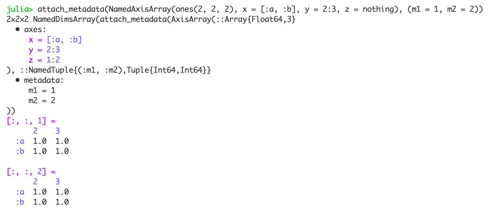

# AxisIndices.jl


[](https://Tokazama.github.io/AxisIndices.jl/stable)
[](https://Tokazama.github.io/AxisIndices.jl/dev)
[](https://codecov.io/gh/Tokazama/AxisIndices.jl)

Here are some reasons you should try AxisIndices
* **Flexible design** for **customizing multidimensional indexing** behavior
* **It's fast**. [StaticRanges](https://github.com/Tokazama/StaticRanges.jl) are used to speed up indexing ranges. If something is slow, please create a detailed issue.
* **Works with Julia's standard library** (in progress). The end goal of AxisIndices is to fully integrate with the standard library wherever possible. If you can find a relevant method that isn't supported in `Base`or  `Statistics` then it's likely an oversight, so make an issue. `LinearAlgebra`, `MappedArrays`, `OffsetArrays`, and `NamedDims` also have some form of support.

Note that in the Julia REPL an `AxisArray` prints as follows, which may not be apparent in the online documentation.


## A Simple `AxisArray`

The simplest form of an `AxisArray` just wraps a standard array.

```julia
julia> using AxisIndices

julia> x = reshape(1:8, 2, 4);

julia> ax = AxisArray(x)
2×4 AxisArray(reshape(::UnitRange{Int64}, 2, 4)
  • axes:
     1 = 1:2
     2 = 1:4
)
     1  2  3  4
  1  1  3  5  7
  2  2  4  6  8  

```

Simply wrapping `x` allows us to use functions to access its elements.
When using functions as indexing arguments, the axis corresponding to each argument is ultimately filtered by the function.

```julia
julia> ax[:, >(2)]
2×2 AxisArray(::Array{Int64,2}
  • axes:
     1 = 1:2
     2 = 1:2
)
     1  2
  1  5  7
  2  6  8  

julia> ax[:, >(2)] == ax[:,filter(>(2), axes(ax, 2))] == ax[:, 3:4]
true
```

This can be particularly helpful when indexing arguments for large arrays would otherwise require combining two or more non-continuous sets of indices.
For example, if we wanted to get every element except for those at one index along the second dimension you would need to do something like:

```julia
julia> not_index = 2;      # the index we don't want to include

julia> axis = axes(x, 2);  # the axis that we want to refer to

julia> inds_before = firstindex(axis):(not_index - 1);  # all of the indices before `not_index` 

julia> inds_after = (not_index + 1):lastindex(axis);    # all of the indices after `not_index`

julia> x[:, vcat(inds_before, inds_after)]
2×3 Array{Int64,2}:
 1  5  7
 2  6  8

```

Using an `AxisArray`, this only requires one line of code
```julia
julia> ax[:, !=(2)]
2×3 AxisArray(::Array{Int64,2}
  • axes:
     1 = 1:2
     2 = 1:3
)
     1  2  3
  1  1  5  7
  2  2  6  8  
```

We can using `ChainedFixes` to combine multiple functions.
```julia
julia> using ChainedFixes

julia> ax[:, or(<(2), >(3))]  # == ax[:, [1, 4]]
2×2 AxisArray(::Array{Int64,2}
  • axes:
     1 = 1:2
     2 = 1:2
)
     1  2
  1  1  7
  2  2  8  

julia> ax[:, and(>(1), <(4))]
2×2 AxisArray(::Array{Int64,2}
  • axes:
     1 = 1:2
     2 = 1:2
)
     1  2
  1  3  5
  2  4  6  

```

Although these examples are simple and could be done by hand (i.e. without producing the indices programmatically), arrays that are larger or have unknown indices are more easily managed.

## An `AxisArray` with Keys

All arguments after the array passed to `AxisArray` are applied to corresponding axes.
We can bind a set of keys to an axis when constructing an `AxisArray` by providing them in the corresponding axis argument position.
Whenever altering an axis we need to provide an argument for each dimension.
In the following example we pass `nothing, (.1:.1:.4)s`, which means the first axis won't be changed and the second axis will have `(.1:.1:.4)s` bound to it.
```julia
julia> import Unitful: s

julia> ax = AxisArray(x, nothing, (.1:.1:.4)s)
2×4 AxisArray(reshape(::UnitRange{Int64}, 2, 4)
  • axes:
     1 = 1:2
     2 = (0.1:0.1:0.4) s
)
     0.1 s  0.2 s  0.3 s  0.4 s
  1      1      3      5      7
  2      2      4      6      8  

```

We can still use functions to access these elements
```julia
julia> ax[:, <(0.3s)]
2×2 AxisArray(::Array{Int64,2}
  • axes:
     1 = 1:2
     2 = (0.1:0.1:0.2) s
)
     0.1 s  0.2 s
  1      1      3
  2      2      4  

```

This also allows us to use keys as indexing arguments...
```julia
julia> ax[1, 0.1s]
1
```
...or as intervals.
```julia
julia> ax[:, 0.1s..0.3s]
2×3 AxisArray(::Array{Int64,2}
  • axes:
     1 = 1:2
     2 = (0.1:0.1:0.3) s
)
     0.1 s  0.2 s  0.3 s
  1      1      3      5
  2      2      4      6  

```


## Offset Indexing

Indices don't have to start at one if we don't want them to.
```julia
julia> ax = AxisArray(x, 2:3, 2:5)
2×4 AxisArray(reshape(::UnitRange{Int64}, 2, 4)
  • axes:
     1 = 2:3
     2 = 2:5
)
     2  3  4  5
  2  1  3  5  7
  3  2  4  6  8  

julia> ax[:,2]
2-element AxisArray(::Array{Int64,1}
  • axes:
     1 = 2:3
)
     1
  2  1
  3  2  

```

If you don't know the length of each axis beforehand you can use `offset`.
The argument passed to offset specifies how much the standard indices should be adjusted by.
To start indexing at `2` we need to offset one-based indexing by +1.
```julia
julia> ax = AxisArray(x, offset(1), offset(1))
2×4 AxisArray(reshape(::UnitRange{Int64}, 2, 4)
  • axes:
     1 = 2:3
     2 = 2:5
)
     2  3  4  5
  2  1  3  5  7
  3  2  4  6  8  

```

We can also center each axis.
```julia
julia> ax = AxisArray(x, center, center)
2×4 AxisArray(reshape(::UnitRange{Int64}, 2, 4)
  • axes:
     1 = -1:0
     2 = -2:1
)
      -2  -1  0  1
  -1   1   3  5  7
  0    2   4  6  8  

```

The default origin of each centered axis is zero, but we can choose any origin.
```julia
julia> ax = AxisArray(reshape(1:9, 3, 3), center(10), center(10))
3×3 AxisArray(reshape(::UnitRange{Int64}, 3, 3)
  • axes:
     1 = 9:11
     2 = 9:11
)
      9  10  11
  9   1   4   7
  10  2   5   8
  11  3   6   9  

```

## Static Sizing

Sometimes we know the size of the arrays we'll be working with beforehand.
This can be encoded in the axis using `ArrayInterface.StaticInt`.

```julia
julia> using ArrayInterface

julia> import ArrayInterface: StaticInt

julia> ax = AxisArray{Int}(
          undef,                      # initialize empty array
          StaticInt(1):StaticInt(2),  # first  axis with known size of two
          StaticInt(1):StaticInt(2)   # second axis with known size of two
       );

julia> ArrayInterface.known_length(typeof(ax)) # size is known at compile time
4

julia> ax[1:2, 1:2] .= x[1:2, 1:2];  # underlying type is mutable `Array`, so we can assign new values

julia> ax
2×2 AxisArray(::Array{Int64,2}
  • axes:
     1 = 1:2
     2 = 1:2
)
     1  2
  1  1  3
  2  2  4  

```

## Encoding Types as Axes

If each element along a particular axis corresponds to a field of a type then we can encode that information in the axis.
```julia
julia> ax = AxisArray(reshape(1:4, 2, 2), StructAxis{Complex{Float64}}(), [:a, :b])
2×2 AxisArray(reshape(::UnitRange{Int64}, 2, 2)
  • axes:
     1 = [:re, :im]
     2 = [:a, :b]
)
       :a   :b 
  :re  1    3
  :im  2    4  

```

We can then create a lazy mapping of that type across views of the array.
```julia
julia> axview = struct_view(ax)
2-element AxisArray(mappedarray(Complex{Float64}, view(reshape(::UnitRange{Int64}, 2, 2), 1, :), view(reshape(::UnitRange{Int64}, 2, 2), 2, :))
  • axes:
     1 = [:a, :b]
)
      1    
  :a  1.0 + 2.0im
  :b  3.0 + 4.0im  

julia> axview[:b]
3.0 + 4.0im

```

## Attaching Metadata

Using the `Metadata` package, metadata can be added to an `AxisArray`.
```julia
julia> using Metadata

julia> mx = attach_metadata(AxisArray(x))
2×4 attach_metadata(AxisArray(reshape(::UnitRange{Int64}, 2, 4)
  • axes:
     1 = 1:2
     2 = 1:4
), ::Dict{Symbol,Any}
  • metadata:
)
     1  2  3  4
  1  1  3  5  7
  2  2  4  6  8

julia> mx.m1 = 1;

julia> mx.m1
1

```

Metadata can also be attached to an axis.
```julia
julia> m = (a = 1, b = 2);

julia> ax = AxisArray(x, nothing, attach_metadata(m));

julia> metadata(ax, dim=2)
(a = 1, b = 2)

```

## Padded Axes

We can also pad axes in various ways.
```julia
julia> x = [:a, :b, :c, :d];

julia> AxisArray(x, circular_pad(first_pad=2, last_pad=2))
8-element AxisArray(::Array{Symbol,1}
  • axes:
     1 = -1:6
)
      1
  -1   :c
  0    :d
  1    :a
  2    :b
  3    :c
  4    :d
  5    :a
  6    :b  

julia> AxisArray(x, replicate_pad(first_pad=2, last_pad=2))
8-element AxisArray(::Array{Symbol,1}
  • axes:
     1 = -1:6
)
      1
  -1   :a
  0    :a
  1    :a
  2    :b
  3    :c
  4    :d
  5    :d
  6    :d  

julia> AxisArray(x, symmetric_pad(first_pad=2, last_pad=2))
8-element AxisArray(::Array{Symbol,1}
  • axes:
     1 = -1:6
)
      1
  -1   :c
  0    :b
  1    :a
  2    :b
  3    :c
  4    :d
  5    :c
  6    :b  

julia> AxisArray(x, reflect_pad(first_pad=2, last_pad=2))
8-element AxisArray(::Array{Symbol,1}
  • axes:
     1 = -1:6
)
      1
  -1   :b
  0    :a
  1    :a
  2    :b
  3    :c
  4    :d
  5    :d
  6    :c  

julia> AxisArray(3:4, zero_pad(sym_pad=2))
6-element AxisArray(::UnitRange{Int64}
  • axes:
     1 = -1:4
)
      1
  -1  0
  0   0
  1   3
  2   4
  3   0
  4   0  

julia> AxisArray(3:4, one_pad(sym_pad=2))
6-element AxisArray(::UnitRange{Int64}
  • axes:
     1 = -1:4
)
      1
  -1  1
  0   1
  1   3
  2   4
  3   1
  4   1  

```

## Named Axes

Names can be attached to each dimension/axis using `NamedAxisArray`.
```julia
julia> nax = NamedAxisArray(reshape(1:4, 2, 2), x = [:a, :b], y = ["c", "d"])
2×2 NamedDimsArray(AxisArray(reshape(::UnitRange{Int64}, 2, 2)
  • axes:
     x = [:a, :b]
     y = ["c", "d"]
))
      "c"   "d" 
  :a  1     3
  :b  2     4  

```
